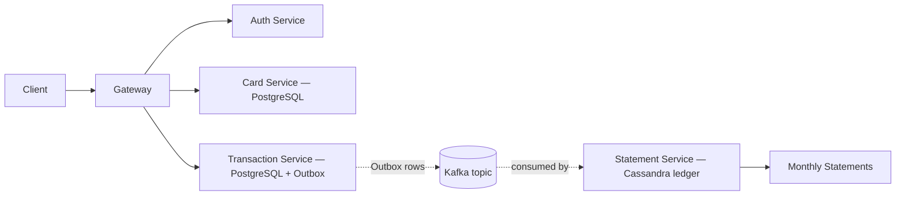

# FleetFlow Microservices Suite (Java 21 • Spring Boot 3)

> A compact, production-style **fleet transactions & statements** prototype showing Clean Architecture, event-driven design (Outbox), and ops-ready microservices.
---

## TL;DR

* **Services:** `gateway`, `auth-service`, `card-service`, `transaction-service` (Outbox), `statement-service` (Cassandra ledger)
* **Infra:** Kafka, PostgreSQL, Cassandra, Prometheus, Grafana
* **Ops:** Micrometer → Prometheus, starter Grafana dashboards, health probes, containerized dev, CI with GitHub Actions
* **Architecture:** Clean Architecture boundaries, REST APIs with OpenAPI annotations, Outbox pattern (DB → event stream), resilience hooks

---

## Why this repo exists

Hiring teams for Java/Spring roles look for production behaviors, not just code: **contracts, tests, CI, observability, and safe deploys**. FleetFlow provides a runnable baseline that demonstrates:

* **Microservices in Java 21 / Spring Boot 3** with clear boundaries
* **Event-driven consistency** via an **Outbox** table (ready to publish to Kafka)
* **Operability**: metrics, dashboards, health checks, container orchestration
* **Testability** with **Testcontainers** suites (Postgres/Kafka)

Use it to showcase end-to-end competency, extend it for interviews, or adapt it as a template.

---

## Architecture overview

### Logical components

* **Gateway** — Spring Cloud Gateway routing to downstream services (edge entrypoint)
* **Auth Service** — Issues JWTs (dev HS256 key); role claims (`admin`, `operator`, `auditor`)
* **Card Service** — Cards CRUD (PostgreSQL via JPA)
* **Transaction Service** — Authorize transactions → **write Outbox rows** (PostgreSQL) for reliable publication
* **Statement Service** — Ledger & statements (Cassandra), demo read endpoint

### Data flow (high-level)



* The current baseline records **Outbox** events; hook up the publisher/consumer to make it fully streaming.

---

## Repo layout (key paths)

```
fleetpay/
  gateway/                      # Spring Cloud Gateway
  auth-service/                 # JWT issuance (dev)
  card-service/                 # Cards (PostgreSQL, JPA)
  transaction-service/          # Transactions + Outbox (PostgreSQL)
  statement-service/            # Ledger + statements (Cassandra)
  platform/                     # Shared configs/util (actuator, JWT helper, error model)
  deploy/compose/               # docker-compose + Prometheus config
  deploy/k8s/kind/              # starter K8s manifests (kind)
  docs/                         # README, ARCHITECTURE, RUNBOOK, Grafana dashboard JSON
  .github/workflows/ci.yml      # GitHub Actions CI (build + test)
```

---

## Quickstart (local dev)

### Prereqs

* JDK 21
* Docker & Docker Compose
* (Optional) `jq` for pretty JSON, and `kind` for K8s experiments

### Build everything

```bash
./gradlew clean build
```

### Run the stack

```bash
docker compose -f deploy/compose/docker-compose.yml up -d --build
```

### Smoke test (via API Gateway on `http://localhost:8088`)

```bash
# 1) Get a dev JWT
curl -s -X POST http://localhost:8088/auth/token -H 'Content-Type: application/json' \
  -d '{ "username":"alice", "role":"admin" }' | jq .

# 2) Issue a card
curl -s -X POST http://localhost:8088/cards -H 'Content-Type: application/json' \
  -d '{ "number":"4111111111111111" }' | jq .

# 3) Authorize a transaction (creates Outbox row)
curl -s -X POST http://localhost:8088/transactions/authorize -H 'Content-Type: application/json' \
  -d '{ "cardNumber":"4111111111111111", "amountCents": 5000, "idempotencyKey":"abc-123" }' | jq .

# 4) Demo statement read
curl -s http://localhost:8088/statements/acct-1/9 | jq .
```

### Observability

* **Prometheus:** [http://localhost:9090](http://localhost:9090)
* **Grafana:** [http://localhost:3000](http://localhost:3000)  (login: `admin` / `admin`)
* Services expose metrics at `/actuator/prometheus`.

---

## Services & ports

| Component           | Local Port | Notes                                         |
| ------------------- | ---------: | --------------------------------------------- |
| Gateway             |       8088 | External entrypoint for all service routes    |
| Auth Service        |   internal | Routed behind gateway                         |
| Card Service        |   internal | PostgreSQL at `postgres:5432`                 |
| Transaction Service |   internal | PostgreSQL + Kafka endpoints                  |
| Statement Service   |   internal | Cassandra at `cassandra:9042`                 |
| PostgreSQL          |       5432 | DB name `fleetpay`, user `fleet`, pwd `fleet` |
| Kafka               |       9092 | Dev cluster via docker-compose                |
| Prometheus          |       9090 | Scrapes all services                          |
| Grafana             |       3000 | Preloaded example dashboard JSON in `docs/`   |

> “internal” = the service listens on container network and is reachable through the **Gateway**.

---

## API sketch

All routes are served through the **Gateway** (`http://localhost:8088`).

### Auth

`POST /auth/token` → `{ token: "…" }` (dev signing; role claim provided)

### Cards

`POST /cards` → create card `{ number: "4111..." }`
`GET /cards` → list cards

### Transactions

`POST /transactions/authorize` → authorize & create **Outbox** event
Payload: `{ "cardNumber": "…", "amountCents": 5000, "idempotencyKey": "abc-123" }`

### Statements

`GET /statements/{accountId}/{month}` → demo read from ledger table

OpenAPI UI (Springdoc) is enabled per service (reachable via container network). For public exposure, proxy UI paths through the gateway as desired.

---

## Clean Architecture mapping

* **Domain:** JPA entities / ledger records, value objects
* **Use-cases (application services):** controllers + service methods orchestrating persistence and outbox writes
* **Adapters:** REST controllers (web adapter), JPA repositories (persistence), future Kafka publisher/consumer (messaging)

Small functions, clear naming, and explicit boundaries favor testability and maintainability.

---

## Testing

* **Unit & integration**: JUnit 5, AssertJ
* **Testcontainers**:

    * `card-service` → Postgres container
    * `transaction-service` → Postgres + Kafka containers
* To run: `./gradlew test` (already invoked by the build)

> Extend with consumer/producer tests once you add the outbox publisher and statement consumer.

---

## CI/CD

GitHub Actions workflow (`.github/workflows/ci.yml`) does:

1. Checkout + JDK 21 toolchain
2. `./gradlew clean build` (unit + integration)
3. Uploads test reports as artifacts

You can extend this with:

* Image builds & scans
* Pact/contract tests
* Kind-based e2e smoke

---

## Security (dev baseline)

* **JWT**: HS256 demo key (do **not** use in prod).
* Add asymmetric keypairs and rotation for production; verify role claims at the gateway and per service.

---

## Resilience & observability

* **Resilience hooks** via Resilience4j (library is wired in shared platform; add policies per integration call)
* **Micrometer → Prometheus** scrape configs in `deploy/compose/prometheus.yml`
* Example **Grafana** dashboard JSON in `docs/grafana/api-latency.json` (p95 latency)

---

## Roadmap (suggested next steps)

* [ ] Outbox **publisher** (transaction-service) → Kafka topic
* [ ] Statement **consumer** (statement-service) → append entries to Cassandra
* [ ] **Idempotency** keys table + de-dup (tx service)
* [ ] **Flyway** migrations (replace `ddl-auto`), seed scripts
* [ ] **Rate limiting** / authz at the gateway
* [ ] **Contract tests** (Pact) between gateway ↔ services
* [ ] **Helm/Kustomize** full manifests, `kind` e2e smoke job in CI
* [ ] Additional **dashboards**: JVM, DB pool saturation, Kafka consumer lag

---

## Troubleshooting

* **Docker memory/CPU**: Ensure Docker has ≥ 4 GB RAM; Cassandra/Kafka are hungry.
* **Port conflicts**: Free 5432, 9042, 9090, 3000, 8088 or change mappings in compose.
* **Testcontainers fails behind VPN**: Try toggling VPN, ensure Docker can pull base images.
* **Grafana empty**: Confirm Prometheus targets are `UP` and services expose `/actuator/prometheus`.

---

## License

Choose a license appropriate for your use case (e.g., MIT/Apache-2.0). Add a `LICENSE` file if you plan to share publicly.

---

### Credits

Built to demonstrate professional practices for Java/Spring microservices: **clean architecture + event-driven consistency + observability + CI**.
